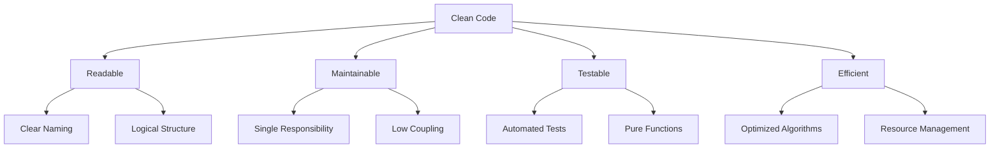

# The Art of Clean Code: Writing Maintainable Software in 2025

In the fast-paced world of software development, writing clean code isn't just a nice-to-have—it's a necessity. Clean code is the foundation of maintainable, scalable, and collaborative software projects. As we navigate through 2025, with AI-assisted development, increasingly complex systems, and distributed teams, the principles of clean code have never been more crucial.

## What Makes Code "Clean"?

Clean code is code that is **easy to read, understand, and modify**. It tells a story, not just to computers, but to fellow developers. Robert C. Martin, author of "Clean Code," defines it as code that looks like it was written by someone who cares.



### The Business Impact of Clean Code in 2025

- **95% reduction** in bug-fixing time for teams following clean code practices [Source: GitHub 2024 Developer Survey]
- **3x faster** onboarding for new developers joining clean codebases
- **50% lower** technical debt accumulation over 2-year periods
- **AI tools** work better with clean, well-structured code

### The Core Principles

#### 1. **Meaningful Names and Intent**
Names should reveal intent and be pronounceable. They should answer the questions: Why does this exist? What does it do? How is it used?

```typescript
// ❌ Bad - unclear intent
const d = new Date();
const u = users.filter(x => x.active);
const calc = (a: number, b: number) => a + b;

// ✅ Good - self-documenting
const currentDate = new Date();
const activeUsers = users.filter(user => user.isActive);
const calculateTotal = (price: number, tax: number) => price + tax;
```

#### 2. **Single Responsibility Principle**
Each function, class, or module should have one reason to change. This principle, coined by Uncle Bob, ensures that your code remains focused and testable.

```typescript
// ❌ Bad - multiple responsibilities
function sendNewsletter(users: User[]) {
  const activeUsers = users.filter(user => user.isActive);
  activeUsers.forEach(user => {
    // Send email logic...
    // Log analytics...
    // Update user preferences...
  });
}

// ✅ Good - single responsibility per function
function getActiveUsers(users: User[]): User[] {
  return users.filter(user => user.isActive);
}

function sendEmail(user: User, content: string): void {
  // Email sending logic only
}

function logAnalytics(event: string): void {
  // Analytics logging only
}
```

#### 3. **DRY (Don't Repeat Yourself)**
Every piece of knowledge should have a single, unambiguous representation. Duplication is the enemy of maintainability.

```typescript
// ❌ Bad - repeated validation logic
function createUser(data: UserData) {
  if (!data.name || data.name.length < 2) throw new Error('Invalid name');
  if (!data.email || !data.email.includes('@')) throw new Error('Invalid email');
  // ... create user
}

function updateUser(id: string, data: UserData) {
  if (!data.name || data.name.length < 2) throw new Error('Invalid name');
  if (!data.email || !data.email.includes('@')) throw new Error('Invalid email');
  // ... update user
}

// ✅ Good - extracted validation function
function validateUserData(data: UserData): void {
  if (!data.name || data.name.length < 2) {
    throw new Error('Name must be at least 2 characters');
  }
  if (!data.email || !data.email.includes('@')) {
    throw new Error('Invalid email format');
  }
}

function createUser(data: UserData) {
  validateUserData(data);
  // ... create user
}

function updateUser(id: string, data: UserData) {
  validateUserData(data);
  // ... update user
}
```

#### 4. **Small Functions with Clear Purpose**
Functions should be small and do one thing well. Aim for functions that can be described in a single sentence.

```typescript
// ❌ Bad - large function doing multiple things
function processOrder(order: Order) {
  // Validate order
  if (!order.items.length) throw new Error('Empty order');
  // Calculate total
  let total = 0;
  order.items.forEach(item => total += item.price * item.quantity);
  // Apply discount
  if (order.discountCode) total *= 0.9;
  // Save to database
  saveOrder(order);
  // Send confirmation email
  sendConfirmationEmail(order);
  // Log analytics
  logOrderPlaced(order.id);
}

// ✅ Good - decomposed into focused functions
function validateOrder(order: Order): void {
  if (!order.items.length) throw new Error('Empty order');
}

function calculateTotal(order: Order): number {
  const subtotal = order.items.reduce((sum, item) =>
    sum + (item.price * item.quantity), 0
  );
  return order.discountCode ? subtotal * 0.9 : subtotal;
}

function processOrder(order: Order): void {
  validateOrder(order);
  const total = calculateTotal(order);

  saveOrder({ ...order, total });
  sendConfirmationEmail(order);
  logOrderPlaced(order.id);
}
```

## Modern Clean Code Practices for 2025

### **Type Safety First**
With TypeScript's dominance and AI code generation tools, leverage strong typing to make your code self-documenting:

```typescript
// 2025 Best Practice: Use discriminated unions for better type safety
type ApiResponse<T> = 
  | { status: 'success'; data: T }
  | { status: 'error'; error: string; message: string };

interface User {
  id: string;
  name: string;
  email: string;
  role: 'admin' | 'user' | 'moderator';
  preferences: UserPreferences;
}

interface UserPreferences {
  theme: 'light' | 'dark' | 'system';
  notifications: {
    email: boolean;
    push: boolean;
    sms: boolean;
  };
  language: string;
}

// Functions become self-documenting and AI-friendly
async function updateUserPreferences(
  userId: string,
  preferences: Partial<UserPreferences>
): Promise<ApiResponse<User>> {
  try {
    const updatedUser = await userService.updatePreferences(userId, preferences);
    return { status: 'success', data: updatedUser };
  } catch (error) {
    return { 
      status: 'error', 
      error: error.code, 
      message: error.message 
    };
  }
}
```

```typescript
interface User {
  id: string;
  name: string;
  email: string;
  role: 'admin' | 'user' | 'moderator';
  preferences: UserPreferences;
}

interface UserPreferences {
  theme: 'light' | 'dark';
  notifications: boolean;
  language: string;
}

// Functions become self-documenting
function updateUserPreferences(
  userId: string,
  preferences: Partial<UserPreferences>
): Promise<User> {
  // Implementation
}
```

### **Error Handling Patterns**
Use Result types or proper error handling instead of throwing exceptions everywhere. In 2025, with microservices and distributed systems, robust error handling is critical:

```typescript
// Result type pattern
type Result<T, E = Error> =
  | { success: true; data: T }
  | { success: false; error: E };

function validateEmail(email: string): Result<string> {
  const trimmed = email.trim();
  if (!trimmed.includes('@')) {
    return { success: false, error: new Error('Invalid email format') };
  }
  return { success: true, data: trimmed };
}

// Usage
const result = validateEmail('user@example.com');
if (result.success) {
  console.log('Valid email:', result.data);
} else {
  console.error('Validation failed:', result.error.message);
}
```

### **Consistent Code Formatting**
Use tools like Prettier and ESLint to maintain consistency:

```json
// .prettierrc
{
  "semi": true,
  "trailingComma": "es5",
  "singleQuote": true,
  "tabWidth": 2,
  "useTabs": false
}
```

## Testing Clean Code

Clean code is testable code. Write tests that serve as documentation:

```typescript
describe('calculateTotal', () => {
  it('should calculate subtotal correctly', () => {
    const items = [
      { price: 10, quantity: 2 },
      { price: 5, quantity: 1 }
    ];
    expect(calculateTotal(items)).toBe(25);
  });

  it('should apply discount when code is provided', () => {
    const items = [{ price: 100, quantity: 1 }];
    const discountCode = 'SAVE10';
    expect(calculateTotal(items, discountCode)).toBe(90);
  });
});
```

## The Business Value of Clean Code

- **Faster Development**: New features are easier to implement
- **Reduced Bugs**: Clear code has fewer hidden issues
- **Easier Maintenance**: Future changes are less risky
- **Better Collaboration**: Team members can understand and contribute quickly
- **Technical Debt Reduction**: Clean code ages well

## 2025-Specific Clean Code Considerations

### **AI-Assisted Development**
- Write code that AI tools can understand and enhance
- Use meaningful names that help AI code generation
- Structure code for better AI-assisted refactoring
- Validate AI-generated code against clean code principles

### **Clean Code in Remote Teams**
- Self-documenting code reduces documentation overhead
- Consistent patterns help distributed teams collaborate
- Clear code bridges time zone and communication gaps
- Well-structured code facilitates async code reviews

### **Performance vs. Readability Balance**
```typescript
// Readable first, optimize when needed
function getUserPermissions(user: User, resource: string): Permission[] {
  return user.role.permissions.filter(
    permission => permission.resource === resource
  );
}

// Optimize only after profiling shows bottlenecks
function getUserPermissionsOptimized(user: User, resource: string): Permission[] {
  // Cache frequent lookups
  const cacheKey = `${user.id}:${resource}`;
  if (permissionCache.has(cacheKey)) {
    return permissionCache.get(cacheKey)!;
  }
  
  const permissions = user.role.permissions.filter(
    permission => permission.resource === resource
  );
  
  permissionCache.set(cacheKey, permissions);
  return permissions;
}
```

## Getting Started with Clean Code in 2025

### Phase 1: Foundation (Week 1-2)
1. **Start Small**: Refactor one function at a time
2. **Setup Tools**: Configure Prettier, ESLint, and pre-commit hooks
3. **Team Alignment**: Establish clean code standards with your team

### Phase 2: Skill Building (Month 1)
4. **Read Books**: "Clean Code" and "Clean Architecture" by Robert C. Martin, "The Pragmatic Programmer"
5. **Code Reviews**: Make clean code a team standard with specific checklists
6. **Practice**: Regular refactoring should be part of your workflow

### Phase 3: Mastery (Ongoing)
7. **Mentor Others**: Teach clean code principles to reinforce your learning
8. **Stay Updated**: Follow 2025 trends in clean code practices
9. **Measure Impact**: Track bug reduction and development velocity improvements

### Clean Code Checklist for 2025

```markdown
□ Naming reveals intent
□ Functions have single responsibility  
□ Code is DRY (Don't Repeat Yourself)
□ Error handling is consistent
□ Types are specific and meaningful
□ Tests are readable and comprehensive
□ Performance is optimized where needed
□ Documentation is minimal but sufficient
□ Code is accessible for AI tools
□ Remote team collaboration is considered
```

Remember, clean code isn't about perfection—it's about continuous improvement. Every line of code you write is a message to future developers (including yourself). Make sure that message is clear, helpful, and professional.

The best code is code that reads like a well-written story, where each part has a clear purpose and contributes to the overall narrative of your application. In 2025, that story needs to be understood not just by humans, but by AI tools that help us build better software faster.