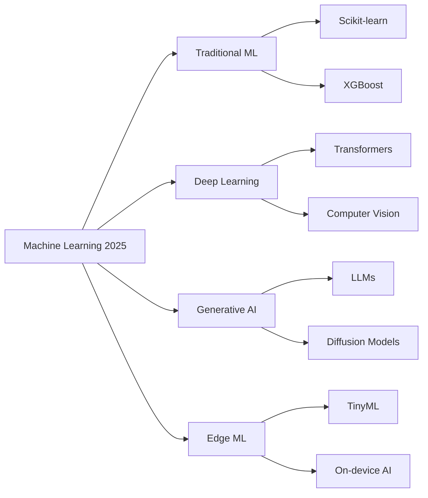
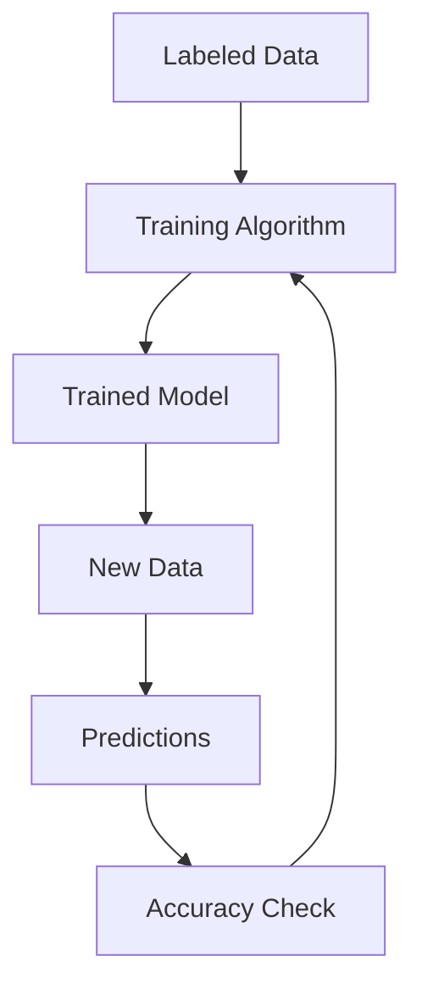
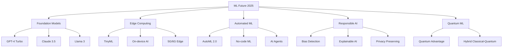

# Machine Learning Fundamentals: A Complete Guide for 2025

Machine Learning (ML) has evolved from an academic curiosity to the backbone of modern technology. From recommendation systems that power Netflix to computer vision systems that enable autonomous vehicles, ML algorithms are solving complex problems across every industry. This comprehensive guide will take you through the fundamental concepts, algorithms, and best practices that form the foundation of machine learning in 2025.

## The ML Landscape in 2025



### Key Trends for 2025:
- **Foundation Models** are revolutionizing NLP and computer vision
- **Edge AI** enables real-time processing on devices
- **AutoML** democratizes machine learning development
- **MLOps maturity** is becoming standard practice
- **Responsible AI** frameworks are increasingly important

## What is Machine Learning?

Machine Learning is a subset of artificial intelligence that enables computers to learn and make decisions from data without being explicitly programmed for every possible scenario. Instead of writing hardcoded rules, ML algorithms learn patterns and relationships from examples.

```python
# Traditional programming vs Machine Learning
# Traditional: if x > 5: result = "high"
# Machine Learning: learns from examples to predict outcomes
```

## The Three Pillars of Machine Learning

### 1. **Supervised Learning**: Learning from Labeled Data

Supervised learning algorithms learn from input-output pairs to predict outcomes for new data. In 2025, this remains the most widely used ML approach.



#### **Classification**: Predicting Categories
```python
from sklearn.ensemble import RandomForestClassifier
from sklearn.model_selection import train_test_split
from sklearn.metrics import accuracy_score
import pandas as pd

# Example: Email spam classification
data = pd.read_csv('emails.csv')
X = data[['word_count', 'contains_free', 'sender_trust_score']]
y = data['is_spam']

X_train, X_test, y_train, y_test = train_test_split(X, y, test_size=0.2)

model = RandomForestClassifier(n_estimators=100, random_state=42)
model.fit(X_train, y_train)

predictions = model.predict(X_test)
accuracy = accuracy_score(y_test, predictions)
print(f"Model accuracy: {accuracy:.2%}")
```

**Popular Classification Algorithms:**
- **Logistic Regression**: Simple, interpretable, great for binary classification
- **Decision Trees**: Easy to visualize, handles both numerical and categorical data
- **Random Forest**: Ensemble method, robust against overfitting
- **Support Vector Machines (SVM)**: Effective in high-dimensional spaces
- **Neural Networks**: Powerful for complex patterns, requires more data

#### **Regression**: Predicting Continuous Values
```python
from sklearn.linear_model import LinearRegression
from sklearn.metrics import mean_squared_error
import numpy as np

# Example: House price prediction
# Features: square_feet, bedrooms, bathrooms, location_score
X = np.array([
    [1500, 3, 2, 8.5],
    [2000, 4, 3, 9.2],
    [1200, 2, 1, 7.8]
])
y = np.array([350000, 500000, 280000])  # prices

model = LinearRegression()
model.fit(X, y)

# Predict price for a new house
new_house = np.array([[1800, 3, 2, 8.7]])
predicted_price = model.predict(new_house)
print(f"Predicted price: ${predicted_price[0]:,.0f}")
```

### 2. **Unsupervised Learning**: Finding Hidden Patterns

Unsupervised learning discovers hidden structures in data without labeled examples.

#### **Clustering**: Grouping Similar Items
```python
from sklearn.cluster import KMeans
from sklearn.preprocessing import StandardScaler
import matplotlib.pyplot as plt

# Example: Customer segmentation
customer_data = pd.read_csv('customers.csv')
features = ['annual_income', 'spending_score', 'age']

# Standardize features
scaler = StandardScaler()
X_scaled = scaler.fit_transform(customer_data[features])

# K-means clustering
kmeans = KMeans(n_clusters=5, random_state=42, n_init=10)
customer_data['cluster'] = kmeans.fit_predict(X_scaled)

# Visualize clusters
plt.scatter(customer_data['annual_income'], customer_data['spending_score'],
           c=customer_data['cluster'], cmap='viridis')
plt.xlabel('Annual Income')
plt.ylabel('Spending Score')
plt.title('Customer Segments')
plt.show()
```

#### **Dimensionality Reduction**
```python
from sklearn.decomposition import PCA
from sklearn.manifold import TSNE

# Principal Component Analysis for dimensionality reduction
pca = PCA(n_components=2)
X_pca = pca.fit_transform(X_scaled)

# t-SNE for visualization of high-dimensional data
tsne = TSNE(n_components=2, random_state=42)
X_tsne = tsne.fit_transform(X_scaled)

print(f"Explained variance ratio: {pca.explained_variance_ratio_}")
```

### 3. **Reinforcement Learning**: Learning Through Interaction

Reinforcement learning learns optimal behavior through trial-and-error interactions with an environment.

```python
import gym
import numpy as np

# Example: Q-Learning for CartPole
env = gym.make('CartPole-v1')

# Q-table initialization
q_table = np.zeros([env.observation_space.shape[0], env.action_space.n])

# Training parameters
learning_rate = 0.1
discount_factor = 0.95
epsilon = 1.0
epsilon_decay = 0.995
min_epsilon = 0.01

for episode in range(1000):
    state = env.reset()
    done = False
    total_reward = 0

    while not done:
        # Epsilon-greedy action selection
        if np.random.random() < epsilon:
            action = env.action_space.sample()  # Explore
        else:
            action = np.argmax(q_table[state])  # Exploit

        next_state, reward, done, _ = env.step(action)

        # Q-learning update
        old_value = q_table[state, action]
        next_max = np.max(q_table[next_state])
        new_value = old_value + learning_rate * (reward + discount_factor * next_max - old_value)
        q_table[state, action] = new_value

        state = next_state
        total_reward += reward

    # Decay epsilon
    epsilon = max(min_epsilon, epsilon * epsilon_decay)

    if episode % 100 == 0:
        print(f"Episode {episode}: Total Reward = {total_reward}")

env.close()
```

## Modern Machine Learning Workflow (2024)

### 1. **Data Preparation and Feature Engineering**
```python
import pandas as pd
from sklearn.preprocessing import LabelEncoder, OneHotEncoder
from sklearn.impute import SimpleImputer
from sklearn.pipeline import Pipeline

# Data loading and initial exploration
data = pd.read_csv('dataset.csv')
print(data.head())
print(data.info())
print(data.describe())

# Handle missing values
imputer = SimpleImputer(strategy='mean')
data['numeric_column'] = imputer.fit_transform(data[['numeric_column']])

# Encode categorical variables
le = LabelEncoder()
data['category_encoded'] = le.fit_transform(data['category'])

# One-hot encoding for multi-class categories
ohe = OneHotEncoder(sparse=False)
encoded_features = ohe.fit_transform(data[['multi_category']])
encoded_df = pd.DataFrame(encoded_features, columns=ohe.get_feature_names_out())

# Combine datasets
data = pd.concat([data, encoded_df], axis=1)
```

### 2. **Model Training and Evaluation**
```python
from sklearn.model_selection import train_test_split, cross_val_score
from sklearn.metrics import classification_report, confusion_matrix
from sklearn.model_selection import GridSearchCV

# Split data
X = data.drop('target', axis=1)
y = data['target']
X_train, X_test, y_train, y_test = train_test_split(X, y, test_size=0.2, random_state=42)

# Hyperparameter tuning
param_grid = {
    'n_estimators': [100, 200, 300],
    'max_depth': [10, 20, None],
    'min_samples_split': [2, 5, 10]
}

grid_search = GridSearchCV(
    RandomForestClassifier(random_state=42),
    param_grid,
    cv=5,
    scoring='accuracy',
    n_jobs=-1
)

grid_search.fit(X_train, y_train)
best_model = grid_search.best_estimator_

print(f"Best parameters: {grid_search.best_params_}")
print(f"Best cross-validation score: {grid_search.best_score_:.3f}")

# Evaluate on test set
y_pred = best_model.predict(X_test)
print(classification_report(y_test, y_pred))
print(confusion_matrix(y_test, y_pred))
```

### 3. **Model Interpretability and Explainability**
```python
import shap
import lime
from sklearn.inspection import permutation_importance

# Feature importance
feature_importance = best_model.feature_importances_
feature_names = X.columns

plt.figure(figsize=(10, 6))
plt.barh(feature_names, feature_importance)
plt.xlabel('Feature Importance')
plt.title('Random Forest Feature Importance')
plt.show()

# SHAP values for individual predictions
explainer = shap.TreeExplainer(best_model)
shap_values = explainer.shap_values(X_test)

# Visualize SHAP summary
shap.summary_plot(shap_values, X_test, feature_names=feature_names)
```

## Deep Learning Fundamentals

### Neural Networks Architecture
```python
import tensorflow as tf
from tensorflow import keras
from tensorflow.keras import layers

# Build a simple neural network
model = keras.Sequential([
    layers.Dense(64, activation='relu', input_shape=(input_dim,)),
    layers.Dropout(0.2),
    layers.Dense(32, activation='relu'),
    layers.Dropout(0.2),
    layers.Dense(num_classes, activation='softmax')
])

# Compile the model
model.compile(
    optimizer='adam',
    loss='categorical_crossentropy',
    metrics=['accuracy']
)

# Train the model
history = model.fit(
    X_train, y_train,
    epochs=50,
    batch_size=32,
    validation_split=0.2,
    callbacks=[
        keras.callbacks.EarlyStopping(patience=5, restore_best_weights=True),
        keras.callbacks.ModelCheckpoint('best_model.keras', save_best_only=True)
    ]
)

# Evaluate
test_loss, test_accuracy = model.evaluate(X_test, y_test)
print(f"Test accuracy: {test_accuracy:.3f}")
```

## Best Practices for Machine Learning in 2024

### 1. **Data Quality First**
- Always perform exploratory data analysis (EDA)
- Handle missing values appropriately
- Detect and handle outliers
- Ensure data privacy and ethical considerations

### 2. **Model Validation**
```python
from sklearn.model_selection import cross_val_score, StratifiedKFold

# Cross-validation
cv_scores = cross_val_score(best_model, X, y, cv=StratifiedKFold(n_splits=5))
print(f"Cross-validation scores: {cv_scores}")
print(f"Mean CV score: {cv_scores.mean():.3f} (+/- {cv_scores.std() * 2:.3f})")

# Learning curves
from sklearn.model_selection import learning_curve

train_sizes, train_scores, val_scores = learning_curve(
    best_model, X, y, cv=5, n_jobs=-1,
    train_sizes=np.linspace(0.1, 1.0, 10)
)

plt.plot(train_sizes, train_scores.mean(axis=1), label='Training score')
plt.plot(train_sizes, val_scores.mean(axis=1), label='Validation score')
plt.xlabel('Training Set Size')
plt.ylabel('Score')
plt.legend()
plt.show()
```

### 3. **Model Monitoring and Maintenance**
```python
# Monitor model performance in production
def monitor_model_performance():
    # Check for data drift
    # Monitor prediction latency
    # Track model accuracy over time
    # Set up alerts for performance degradation
    pass

# A/B testing framework
def ab_test_models(model_a, model_b, test_data):
    predictions_a = model_a.predict(test_data)
    predictions_b = model_b.predict(test_data)

    # Statistical significance testing
    # Business metric comparison
    pass
```

## Essential Tools and Libraries

### **Python Ecosystem**
- **NumPy**: Numerical computing
- **Pandas**: Data manipulation and analysis
- **Scikit-learn**: Traditional ML algorithms
- **TensorFlow/PyTorch**: Deep learning frameworks
- **JAX**: High-performance ML research

### **Data Visualization**
- **Matplotlib/Seaborn**: Statistical plotting
- **Plotly**: Interactive visualizations
- **Streamlit**: ML app deployment

### **MLOps Tools**
- **MLflow**: Experiment tracking and model management
- **DVC**: Data version control
- **Weights & Biases**: Experiment monitoring
- **Kubeflow**: ML pipelines on Kubernetes

## Getting Started: Your First ML Project

```python
# Complete beginner's workflow
import pandas as pd
from sklearn.model_selection import train_test_split
from sklearn.ensemble import RandomForestClassifier
from sklearn.metrics import accuracy_score

# 1. Load and explore data
data = pd.read_csv('iris.csv')
print(data.head())
print(data['species'].value_counts())

# 2. Prepare features and target
X = data.drop('species', axis=1)
y = data['species']

# 3. Split data
X_train, X_test, y_train, y_test = train_test_split(X, y, test_size=0.3, random_state=42)

# 4. Train model
model = RandomForestClassifier(n_estimators=100, random_state=42)
model.fit(X_train, y_train)

# 5. Make predictions
predictions = model.predict(X_test)

# 6. Evaluate performance
accuracy = accuracy_score(y_test, predictions)
print(f"Model Accuracy: {accuracy:.3f}")

# 7. Make a prediction on new data
new_flower = pd.DataFrame({
    'sepal_length': [5.1],
    'sepal_width': [3.5],
    'petal_length': [1.4],
    'petal_width': [0.2]
})

prediction = model.predict(new_flower)
print(f"Predicted species: {prediction[0]}")
```

## The Future of Machine Learning

As we move through 2025, several trends are shaping the future of ML:



### Key Developments for 2025:

1. **Foundation Models**: Large-scale pre-trained models that can be fine-tuned for specific tasks
2. **Edge AI**: Real-time processing with minimal latency and privacy benefits
3. **Automated ML**: Democratizing ML development with sophisticated AutoML platforms
4. **MLOps Maturity**: Complete lifecycle management with robust CI/CD for ML
5. **Responsible AI**: Built-in bias detection, explainability, and ethical frameworks
6. **AI Agents**: Autonomous systems that can reason and act independently
7. **Multimodal AI**: Systems that understand and generate text, images, audio, and video

### Skills in High Demand for 2025:
- **Prompt Engineering** for foundation models
- **MLOps Engineering** for production ML systems
- **AI Ethics** and responsible implementation
- **Edge AI Optimization** for resource-constrained environments
- **Quantum ML** preparation for next-generation computing

Machine learning is no longer just an academic pursuit—it's a practical tool that anyone can learn and apply. Whether you're predicting customer behavior, analyzing images, or processing natural language, the fundamentals remain the same: quality data, appropriate algorithms, rigorous evaluation, and continuous improvement.

Start small, experiment often, and remember that every expert was once a beginner. The journey of mastering machine learning is ongoing, but the rewards—both intellectual and practical—are immense. In 2025, the barrier to entry has never been lower, while the potential impact has never been higher.