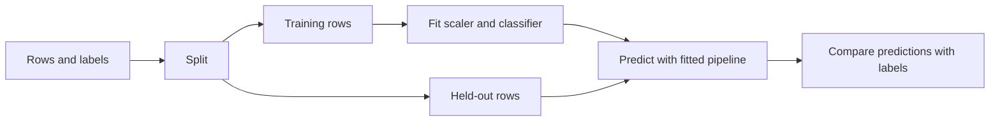

Training a classifier takes a few lines of Python. Working out what its score means takes longer.

For a small example, use the Iris dataset bundled with scikit-learn. Each row contains four flower measurements and a species label. This is supervised classification: fit a mapping from measurements to labels, then check its predictions on rows kept out of training.

## Keep some data out of training

This example needs scikit-learn. It uses the bundled data, so there is no CSV to download or prepare.

```python
from sklearn.datasets import load_iris
from sklearn.dummy import DummyClassifier
from sklearn.linear_model import LogisticRegression
from sklearn.metrics import classification_report
from sklearn.model_selection import train_test_split
from sklearn.pipeline import make_pipeline
from sklearn.preprocessing import StandardScaler

X, y = load_iris(return_X_y=True)
X_train, X_test, y_train, y_test = train_test_split(
    X, y, test_size=0.3, random_state=42, stratify=y
)

baseline = DummyClassifier(strategy="most_frequent")
baseline.fit(X_train, y_train)

model = make_pipeline(
    StandardScaler(),
    LogisticRegression(max_iter=1000, random_state=42),
)
model.fit(X_train, y_train)

print(f"Baseline accuracy: {baseline.score(X_test, y_test):.3f}")
print(classification_report(y_test, model.predict(X_test), zero_division=0))
```

The dummy classifier always predicts the most common training label. It gives the fitted model something concrete to beat. On a heavily imbalanced dataset, an apparently impressive accuracy can be no better than this baseline.

`stratify=y` keeps class proportions similar in the two splits. The fixed random seed makes this particular split repeatable. Neither choice guarantees that the test rows resemble the data the application will see later.

## Fit preprocessing on the training rows

The scaler lives inside the pipeline. During `fit`, it learns the training means and scales; during prediction, it uses those same values on the test rows.

Scaling the entire dataset before splitting lets information from the test set influence training. It can be a subtle mistake because the code runs and the output looks normal. Feature selection and missing-value imputation can leak information in the same way. Scikit-learn's [common pitfalls guide](https://scikit-learn.org/stable/common_pitfalls.html) explains this boundary and how pipelines help maintain it.


```mermaid
flowchart LR
    Data[Rows and labels] --> Split[Split]
    Split --> Train[Training rows]
    Split --> Test[Held-out rows]
    Train --> Fit[Fit scaler and classifier]
    Fit --> Predict[Predict with fitted pipeline]
    Test --> Predict
    Predict --> Compare[Compare predictions with labels]
```

A random row split is only appropriate when rows can reasonably be treated as independent. If several recordings came from the same device or experiment, splitting those recordings across training and test sets may mostly measure recognition of that device. For a forecast, testing on later observations is usually closer to the actual task.

## Read the errors

The classification report includes precision and recall for each class. Precision asks how often a predicted label was correct. Recall asks how many examples of that class the model found.

A missed alarm and a false alarm have different costs. Pick the metric with that distinction in mind, then inspect individual errors. A confusion matrix tells you which classes are getting mixed up; the underlying samples can tell you why.

If you repeatedly adjust a model after looking at its test score, that test set has become part of the development process. Use cross-validation within the training data for those decisions and reserve a final test set for the resulting model.

## Other tasks need different checks

Regression predicts a numeric value. Its errors have units: a temperature error in degrees is easier to interpret than an unexplained aggregate score. Compare against a simple baseline there too.

Clustering assigns groups without known class labels. K-means will return the requested number of clusters even when the data doesn't contain that many useful groups. Scaling and the choice of distance can change the grouping substantially.

Reinforcement learning adds actions and rewards over time. A tabular Q-learning example needs a discrete state representation; a continuous observation vector cannot simply index a Q-table. That extra modeling step is easy to miss in short examples.

## Keep enough information to repeat the run

Record the dataset version, split, preprocessing, parameters, and library versions alongside the score. Save the whole fitted pipeline so inference uses the same transformations as training.

Iris is useful for checking that this workflow runs. It says little about whether a model will hold up on noisy sensor data, changing inputs, or labels collected by different people. Those need their own evaluation data.
