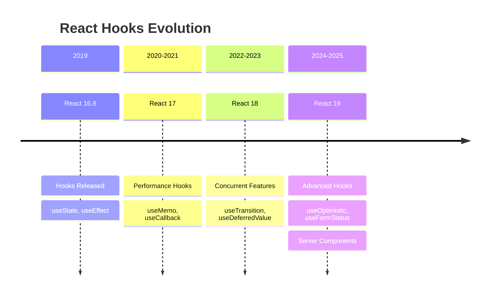
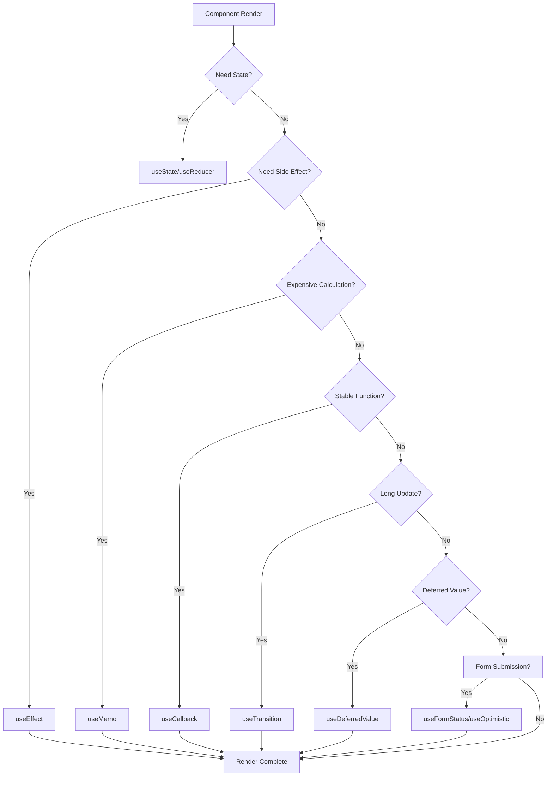
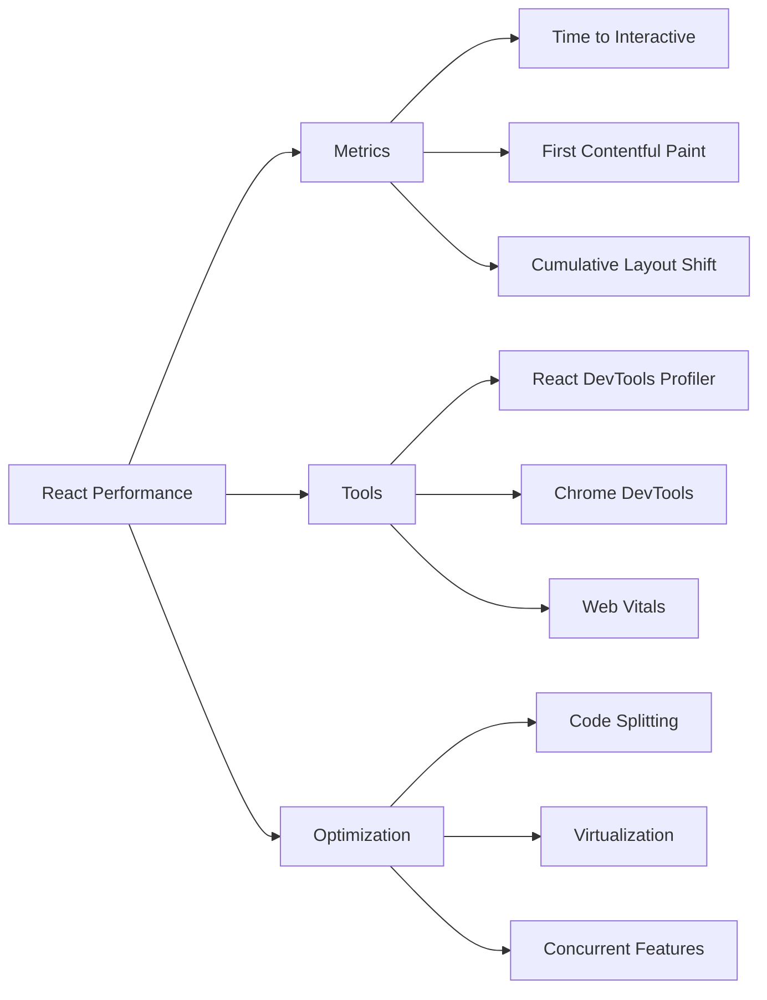

# Mastering React Hooks: Best Practices for Modern React Development

React Hooks transformed React development by enabling stateful logic in functional components. Since their introduction in React 16.8, hooks have become the standard for React development. This comprehensive guide covers everything from basic usage to advanced patterns and performance optimization techniques for 2025.

## React Hooks Evolution: 2019-2025



## The Rules of Hooks

Before diving deep, remember the two fundamental rules:

1. **Only call hooks at the top level** - Never call hooks inside loops, conditions, or nested functions
2. **Only call hooks from React functions** - Call them from React function components or custom hooks

```typescript
// ❌ Wrong - calling hooks conditionally
function BadComponent({ condition }) {
  if (condition) {
    const [state, setState] = useState(''); // This violates the rules!
  }
  return <div />;
}

// ✅ Correct - hooks at top level
function GoodComponent({ condition }) {
  const [state, setState] = useState('');
  return condition ? <div>{state}</div> : null;
}
```

## Essential Hooks Deep Dive

### useState: State Management

`useState` is the foundation of stateful components. It returns a stateful value and a function to update it.

```typescript
function Counter() {
  const [count, setCount] = useState<number>(0);
  const [user, setUser] = useState<User | null>(null);

  const increment = () => setCount(prev => prev + 1);

  // Functional updates prevent stale closure issues
  const asyncIncrement = () => {
    setCount(currentCount => currentCount + 1);
  };

  return (
    <div>
      <p>Count: {count}</p>
      <button onClick={increment}>Increment</button>
    </div>
  );
}
```

**Best Practices:**
- Use functional updates for state based on previous state
- Type your state properly with TypeScript
- Consider `useReducer` for complex state logic

### useEffect: Side Effects

`useEffect` handles side effects like data fetching, subscriptions, and DOM manipulation.

```typescript
function DataFetcher({ userId }: { userId: string }) {
  const [data, setData] = useState(null);
  const [loading, setLoading] = useState(true);
  const [error, setError] = useState(null);

  useEffect(() => {
    let isMounted = true;

    const fetchData = async () => {
      try {
        setLoading(true);
        const response = await fetch(`/api/user/${userId}`);
        const result = await response.json();

        if (isMounted) {
          setData(result);
          setError(null);
        }
      } catch (err) {
        if (isMounted) {
          setError(err.message);
        }
      } finally {
        if (isMounted) {
          setLoading(false);
        }
      }
    };

    fetchData();

    // Cleanup function prevents memory leaks
    return () => {
      isMounted = false;
    };
  }, [userId]); // Re-run when userId changes

  if (loading) return <div>Loading...</div>;
  if (error) return <div>Error: {error}</div>;
  return <div>{JSON.stringify(data)}</div>;
}
```

**Common Pitfalls:**
- Missing dependencies in the dependency array
- Not cleaning up subscriptions
- Infinite re-renders from incorrect dependencies

### useContext: Context Consumption

`useContext` provides a way to consume context without nesting.

```typescript
const ThemeContext = createContext<Theme>('light');

function ThemedButton() {
  const theme = useContext(ThemeContext);

  return (
    <button
      className={`btn btn-${theme}`}
      onClick={() => console.log(`Theme is ${theme}`)}
    >
      Themed Button
    </button>
  );
}
```

## Advanced Hooks

### useReducer: Complex State Logic

For complex state with multiple sub-values or when the next state depends on the previous one.

```typescript
interface State {
  count: number;
  loading: boolean;
  error: string | null;
}

type Action =
  | { type: 'INCREMENT' }
  | { type: 'DECREMENT' }
  | { type: 'SET_LOADING'; payload: boolean }
  | { type: 'SET_ERROR'; payload: string };

function reducer(state: State, action: Action): State {
  switch (action.type) {
    case 'INCREMENT':
      return { ...state, count: state.count + 1 };
    case 'DECREMENT':
      return { ...state, count: state.count - 1 };
    case 'SET_LOADING':
      return { ...state, loading: action.payload };
    case 'SET_ERROR':
      return { ...state, error: action.payload };
    default:
      return state;
  }
}

function Counter() {
  const [state, dispatch] = useReducer(reducer, {
    count: 0,
    loading: false,
    error: null,
  });

  const increment = () => dispatch({ type: 'INCREMENT' });
  const decrement = () => dispatch({ type: 'DECREMENT' });

  return (
    <div>
      <p>Count: {state.count}</p>
      <button onClick={decrement}>-</button>
      <button onClick={increment}>+</button>
    </div>
  );
}
```

### useMemo: Expensive Computations

Memoize expensive calculations to avoid unnecessary re-computations.

```typescript
function ExpensiveList({ items, filter }: { items: Item[], filter: string }) {
  // Only recalculate when items or filter change
  const filteredItems = useMemo(() => {
    console.log('Filtering items...'); // This only logs when dependencies change
    return items.filter(item =>
      item.name.toLowerCase().includes(filter.toLowerCase())
    );
  }, [items, filter]);

  // Memoize the sorted version
  const sortedItems = useMemo(() => {
    return [...filteredItems].sort((a, b) => a.name.localeCompare(b.name));
  }, [filteredItems]);

  return (
    <ul>
      {sortedItems.map(item => (
        <li key={item.id}>{item.name}</li>
      ))}
    </ul>
  );
}
```

### useCallback: Stable Function References

Memoize functions to prevent unnecessary re-renders in child components.

```typescript
function ParentComponent() {
  const [count, setCount] = useState(0);

  // Without useCallback, this function is recreated on every render
  const increment = useCallback(() => {
    setCount(prev => prev + 1);
  }, []); // Empty deps - function never changes

  // With useCallback, child components can optimize re-renders
  const decrement = useCallback(() => {
    setCount(prev => prev - 1);
  }, []);

  return (
    <div>
      <p>Count: {count}</p>
      <ChildComponent onIncrement={increment} onDecrement={decrement} />
    </div>
  );
}

// Child component can use React.memo for optimization
const ChildComponent = React.memo<{
  onIncrement: () => void;
  onDecrement: () => void;
}>(({ onIncrement, onDecrement }) => (
  <div>
    <button onClick={onIncrement}>+</button>
    <button onClick={onDecrement}>-</button>
  </div>
));
```

## Custom Hooks: Reusable Logic

Custom hooks encapsulate reusable logic and promote code reusability.

```typescript
// Custom hook for API calls
function useApi<T>(url: string) {
  const [data, setData] = useState<T | null>(null);
  const [loading, setLoading] = useState(false);
  const [error, setError] = useState<string | null>(null);

  const fetchData = useCallback(async () => {
    try {
      setLoading(true);
      setError(null);

      const response = await fetch(url);
      if (!response.ok) throw new Error('Failed to fetch');

      const result = await response.json();
      setData(result);
    } catch (err) {
      setError(err instanceof Error ? err.message : 'Unknown error');
    } finally {
      setLoading(false);
    }
  }, [url]);

  useEffect(() => {
    fetchData();
  }, [fetchData]);

  return { data, loading, error, refetch: fetchData };
}

// Usage
function UserProfile({ userId }: { userId: string }) {
  const { data: user, loading, error } = useApi<User>(`/api/users/${userId}`);

  if (loading) return <div>Loading...</div>;
  if (error) return <div>Error: {error}</div>;
  if (!user) return <div>User not found</div>;

  return (
    <div>
      <h1>{user.name}</h1>
      <p>{user.email}</p>
    </div>
  );
}
```

### Advanced Custom Hook Patterns

```typescript
// Hook composition
function useForm<T extends Record<string, any>>(initialValues: T) {
  const [values, setValues] = useState<T>(initialValues);
  const [errors, setErrors] = useState<Partial<Record<keyof T, string>>>({});
  const [touched, setTouched] = useState<Partial<Record<keyof T, boolean>>>({});

  const setValue = useCallback(<K extends keyof T>(field: K, value: T[K]) => {
    setValues(prev => ({ ...prev, [field]: value }));
  }, []);

  const setError = useCallback(<K extends keyof T>(field: K, error: string) => {
    setErrors(prev => ({ ...prev, [field]: error }));
  }, []);

  const setTouched = useCallback(<K extends keyof T>(field: K, isTouched = true) => {
    setTouched(prev => ({ ...prev, [field]: isTouched }));
  }, []);

  const reset = useCallback(() => {
    setValues(initialValues);
    setErrors({});
    setTouched({});
  }, [initialValues]);

  return {
    values,
    errors,
    touched,
    setValue,
    setError,
    setTouched,
    reset,
  };
}

// Usage
function LoginForm() {
  const { values, errors, setValue, setError } = useForm({
    email: '',
    password: '',
  });

  const handleSubmit = async (e: React.FormEvent) => {
    e.preventDefault();
    // Validation logic...
  };

  return (
    <form onSubmit={handleSubmit}>
      <input
        type="email"
        value={values.email}
        onChange={e => setValue('email', e.target.value)}
      />
      {errors.email && <span>{errors.email}</span>}
      {/* ... */}
    </form>
  );
}
```

## Performance Optimization

### Avoiding Unnecessary Re-renders

```typescript
function OptimizedList({ items }: { items: Item[] }) {
  // Memoize expensive operations
  const sortedItems = useMemo(() =>
    [...items].sort((a, b) => a.name.localeCompare(b.name)),
    [items]
  );

  // Memoize event handlers
  const handleItemClick = useCallback((item: Item) => {
    console.log('Item clicked:', item);
  }, []);

  return (
    <ul>
      {sortedItems.map(item => (
        <ListItem
          key={item.id}
          item={item}
          onClick={handleItemClick}
        />
      ))}
    </ul>
  );
}

// Memoize child components
const ListItem = React.memo<ItemProps>(({ item, onClick }) => (
  <li onClick={() => onClick(item)}>
    {item.name}
  </li>
));
```

## Modern React Hooks (React 18+ and 19)

### useTransition: Non-blocking UI Updates

```typescript
import { useTransition, useDeferredValue } from 'react';

function SearchComponent({ items }: { items: Item[] }) {
  const [query, setQuery] = useState('');
  const [filteredItems, setFilteredItems] = useState(items);
  const [isPending, startTransition] = useTransition();

  const deferredQuery = useDeferredValue(query);

  useEffect(() => {
    startTransition(() => {
      // This runs with lower priority
      const filtered = items.filter(item =>
        item.name.toLowerCase().includes(deferredQuery.toLowerCase())
      );
      setFilteredItems(filtered);
    });
  }, [deferredQuery, items]);

  return (
    <div>
      <input
        value={query}
        onChange={e => setQuery(e.target.value)}
        placeholder="Search..."
      />
      {isPending && <div>Updating results...</div>}
      <ul>
        {filteredItems.map(item => (
          <li key={item.id}>{item.name}</li>
        ))}
      </ul>
    </div>
  );
}
```

### useDeferredValue: Deferred Updates

```typescript
function SearchResults({ query, items }: { query: string; items: Item[] }) {
  const deferredQuery = useDeferredValue(query);

  const filteredItems = useMemo(() => {
    // Expensive filtering operation
    return items.filter(item =>
      item.name.toLowerCase().includes(deferredQuery.toLowerCase())
    );
  }, [deferredQuery, items]);

  return (
    <div>
      <p>Showing results for: {deferredQuery}</p>
      <ul>
        {filteredItems.map(item => <li key={item.id}>{item.name}</li>)}
      </ul>
    </div>
  );
}
```

## React 19 Hooks (2025)

### useOptimistic: Optimistic UI Updates

```typescript
import { useOptimistic } from 'react';

function TodoList({ todos, addTodo }) {
  const [optimisticTodos, addOptimisticTodo] = useOptimistic(
    todos,
    (state, newTodo) => [...state, { ...newTodo, sending: true }]
  );

  const handleSubmit = async (formData) => {
    const newTodo = { id: Date.now(), text: formData.get('text') };
    
    // Optimistically add to UI
    addOptimisticTodo(newTodo);
    
    try {
      await addTodo(newTodo);
    } catch (error) {
      // Error handling - optimistic update will be reverted
      console.error('Failed to add todo:', error);
    }
  };

  return (
    <div>
      <form action={handleSubmit}>
        <input name="text" placeholder="Add new todo..." />
        <button type="submit">Add</button>
      </form>
      
      <ul>
        {optimisticTodos.map(todo => (
          <li key={todo.id} style={{ opacity: todo.sending ? 0.5 : 1 }}>
            {todo.text}
          </li>
        ))}
      </ul>
    </div>
  );
}
```

### useFormStatus: Form State Management

```typescript
import { useFormStatus } from 'react-dom';

function SubmitButton() {
  const { pending, data, method, action } = useFormStatus();

  return (
    <button 
      type="submit" 
      disabled={pending}
      aria-disabled={pending}
    >
      {pending ? 'Submitting...' : 'Submit'}
    </button>
  );
}

function ContactForm() {
  return (
    <form action="/api/contact">
      <input name="name" placeholder="Your name" />
      <input name="email" placeholder="Your email" />
      <textarea name="message" placeholder="Your message"></textarea>
      <SubmitButton />
    </form>
  );
}
```

### Hook Performance Flow 2025



## Testing Hooks

Hooks should be tested both in isolation and within components.

```typescript
// Custom hook testing
import { renderHook, act } from '@testing-library/react';

test('useCounter increments correctly', () => {
  const { result } = renderHook(() => useCounter(0));

  expect(result.current.count).toBe(0);

  act(() => {
    result.current.increment();
  });

  expect(result.current.count).toBe(1);
});

// Component testing
import { render, screen, fireEvent } from '@testing-library/react';

test('Counter component displays correct count', () => {
  render(<Counter />);

  expect(screen.getByText('Count: 0')).toBeInTheDocument();

  fireEvent.click(screen.getByText('+'));
  expect(screen.getByText('Count: 1')).toBeInTheDocument();
});
```

## Common Mistakes and How to Avoid Them

1. **Stale Closures**: Use functional updates with `useState`
2. **Infinite Loops**: Always include all dependencies in `useEffect`
3. **Memory Leaks**: Always clean up subscriptions and timers
4. **Unnecessary Re-renders**: Use `useMemo` and `useCallback` judiciously
5. **Race Conditions**: Use cleanup functions and loading states

## React Performance in 2025: Key Metrics



## Best Practices for 2025

### 1. **Concurrent Rendering by Default**
- Use React 19's concurrent features
- Implement proper loading states
- Leverage startTransition for non-urgent updates

### 2. **Server Components Integration**
- Move non-interactive components to server
- Reduce client-side JavaScript bundle
- Improve initial page load performance

### 3. **AI-Assisted Development**
- Use AI tools to generate optimal hook patterns
- Validate AI-generated code against best practices
- Leverage AI for performance optimization suggestions

### 4. **Bundle Optimization**
- Implement automatic code splitting
- Use dynamic imports for large components
- Optimize dependencies with tree shaking

### 5. **Performance Budgeting**
- Set performance budgets in CI/CD
- Monitor Core Web Vitals in production
- Use performance regression testing

## Conclusion

React hooks have revolutionized how we write React applications. They provide a more direct way to use React's features in functional components while maintaining the same performance benefits. As we move through 2025, mastering hooks requires understanding both the basic patterns and advanced optimization techniques.

The key to effective hook usage is:
- Following the rules of hooks strictly
- Understanding when to use each hook
- Optimizing performance when necessary
- Creating reusable custom hooks
- Writing testable code
- Leveraging React 19's new capabilities
- Integrating with server components
- Using AI tools responsibly

With these practices, you'll be able to build more maintainable, performant, and scalable React applications that meet the demands of modern web development in 2025.