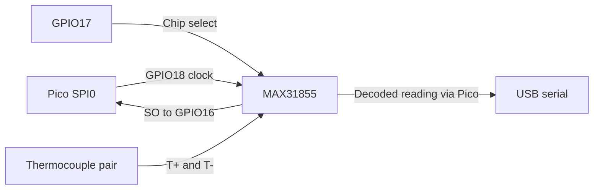
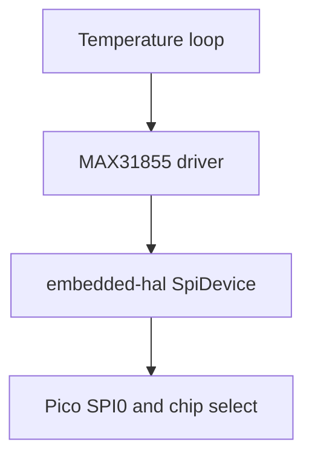
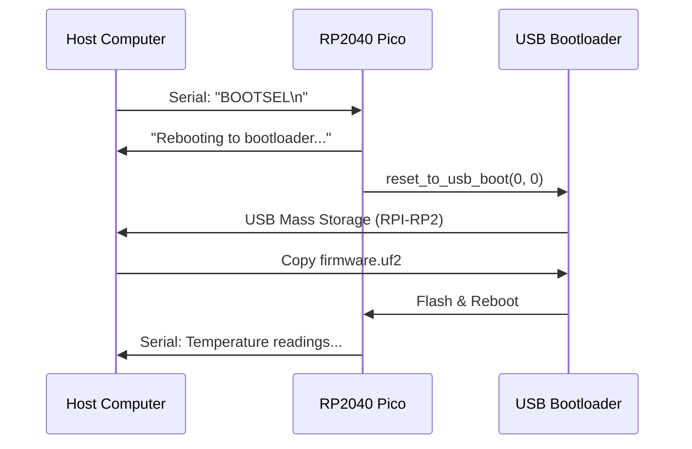

This setup connects a MAX31855 thermocouple converter to a Raspberry Pi Pico and prints temperature over USB serial. It also accepts `BOOTSEL`, so the host can put the Pico into its USB bootloader without pressing the button.

The temperature driver uses embedded-hal traits. The USB command handling and bootloader call are specific to the Pico.

## What the converter measures

A thermocouple produces a voltage related to the temperature difference between its measurement junction and reference junction:

$$V = \int_{T_{cold}}^{T_{hot}} \alpha(T)\,dT$$

Over a small range, treating the Seebeck coefficient as constant gives:

$$V \approx \alpha(T_{hot}-T_{cold})$$

That approximation explains why measuring voltage alone isn't enough to recover the probe temperature. The MAX31855 measures its internal temperature for cold-junction compensation and returns the compensated result digitally. The reference junction and converter need suitable thermal placement for that compensation to be useful.

Its output increments are 0.25°C for the thermocouple and 0.0625°C for the internal sensor. The [MAX31855 datasheet](https://www.analog.com/media/en/technical-documentation/data-sheets/MAX31855.pdf) separates these resolutions from the error specifications.

## Wire SPI0

| MAX31855 pin | Pico connection | Physical pin |
|---|---|---|
| VCC | 3V3 | 36 |
| GND | GND | 38 |
| SCK | GPIO18 | 24 |
| SO | GPIO16 | 21 |
| CS | GPIO17 | 22 |

The converter only sends data, so there is no MOSI connection. Check the breakout board's supply requirements and the probe polarity before powering it.


```mermaid
flowchart LR
    Pico[Pico SPI0] -->|GPIO18 clock| Converter[MAX31855]
    Converter -->|SO to GPIO16| Pico
    CS[GPIO17] -->|Chip select| Converter
    Probe[Thermocouple pair] -->|T+ and T-| Converter
    Converter -->|Decoded reading via Pico| USB[USB serial]
```

The two thermocouple leads go to T+ and T−. They are not separate hot and cold probes.

## Decode the signed fields

Read a 32-bit word with chip select held low. Its layout is:

| Bits | Field |
|---|---|
| 31–18 | Signed thermocouple temperature, 0.25°C per count |
| 17 | Reserved |
| 16 | Summary fault flag |
| 15–4 | Signed internal temperature, 0.0625°C per count |
| 3 | Reserved |
| 2 | Short to VCC |
| 1 | Short to ground |
| 0 | Open circuit |

For the thermocouple field, sign-extend the 14-bit value before converting it:

```rust
// Extract thermocouple temperature (bits 31-18, 14-bit signed)
let thermocouple_raw = ((raw >> 18) & 0x3FFF) as u16;
let thermocouple_signed = if thermocouple_raw & 0x2000 != 0 {
    // Negative temperature - sign extend
    (thermocouple_raw | 0xC000) as i16
} else {
    thermocouple_raw as i16
};
let temperature_c = (thermocouple_signed as f32) * 0.25;
```

For a signed count $D$, the temperature is $T = D/4$ degrees Celsius. The internal reading uses the same idea with a 12-bit field and a divisor of 16.

The result type keeps faults alongside the reading:

```rust
pub enum Fault {
    OpenCircuit,   // Thermocouple disconnected
    ShortToGnd,    // Thermocouple shorted to ground
    ShortToVcc,    // Thermocouple shorted to VCC
}

pub struct TempReading {
    pub temperature_c: f32,
    pub internal_c: f32,
    pub fault: Option<Fault>,
}
```

A caller should check the fault before using the temperature. If several fault bits are set, a single `Option<Fault>` needs a defined precedence or a separate representation of all the flags.

## Put chip select around the whole transaction

The driver should depend on `SpiDevice`, which represents a device transaction including chip select. The board-specific setup supplies that device:


```mermaid
flowchart TD
    App[Temperature loop] --> Driver[MAX31855 driver]
    Driver --> Device[embedded-hal SpiDevice]
    Device --> Bus[Pico SPI0 and chip select]
```

A hand-written wrapper needs more care than pulling CS low, calling `read`, and pulling CS high. If `read` returns an error early, cleanup must still deassert CS. It must also finish the bus transfer before releasing the device and report pin errors. The [embedded-hal SPI documentation](https://docs.rs/embedded-hal/1.0.0/embedded_hal/spi/index.html) defines that transaction contract.

For a dedicated bus, an `embedded-hal-bus` device adapter avoids duplicating this logic. A shared bus needs an adapter that coordinates access among devices.

## Enter the bootloader over serial

The firmware checks a received command and calls the Pico ROM bootloader function:

```rust
use rp_pico::hal::rom_data::reset_to_usb_boot;

// In the main loop, parse incoming serial data
if cmd_buffer == b"BOOTSEL" {
    serial.write(b"Rebooting to bootloader...\r\n");
    delay_ms(100);  // Allow message transmission
    reset_to_usb_boot(0, 0);  // Reboot to USB bootloader
}
```

This excerpt assumes the command parser has collected the line and stripped its terminator. The delay gives the serial response time to leave before reset; it is not an acknowledgment that the host has received it.


```mermaid
sequenceDiagram
    participant Host as Host Computer
    participant Pico as RP2040 Pico
    participant Boot as USB Bootloader

    Host->>Pico: Serial: "BOOTSEL\n"
    Pico->>Host: "Rebooting to bootloader..."
    Pico->>Boot: reset_to_usb_boot(0, 0)
    Boot->>Host: USB Mass Storage (RPI-RP2)
    Host->>Boot: Copy firmware.uf2
    Boot->>Pico: Flash & Reboot
    Pico->>Host: Serial: Temperature readings...
```

The host still needs a USB connection to the Pico. SSH access to that host can make the operation remote, but the transfer to the board is USB, not an over-the-air update. If the application is hung and can't process serial commands, physical BOOTSEL access may still be necessary.

## Build and load the firmware

From the project workspace:

```bash
# Install Rust and ARM target
rustup target add thumbv6m-none-eabi

# Install UF2 converter
cargo install elf2uf2-rs

# Build the project
cd projects/rp2040_thermocouple_test
cargo build --release

# Convert to UF2
elf2uf2-rs target/thumbv6m-none-eabi/release/rp2040-thermocouple-test firmware.uf2
```

For the first load, hold BOOTSEL while connecting USB, then copy the UF2 file to the `RPI-RP2` volume. The board reboots after the transfer.

For a later update, send the command to the firmware's serial port:

```bash
printf 'BOOTSEL\n' > /dev/cu.usbmodem0011
```

Use the port for the attached Pico. Wait for `RPI-RP2` to mount before copying:

```bash
cp firmware.uf2 /Volumes/RPI-RP2/
```

A fixed two-second delay may happen to work on one host; checking for the volume is more reliable in an automated script. After the copy, reconnect to serial and check that the expected firmware is running.

## Read the output carefully

The sample output has this form:

```
=== RP2040 MAX31855 Thermocouple Test ===
SPI: SCK=GPIO18, MISO=GPIO16, CS=GPIO17
Send 'BOOTSEL' to reboot to bootloader
Reading temperature every 2 seconds...

[1] Temp: 21.25 C, Internal: 21.00 C
[2] Temp: 21.25 C, Internal: 21.00 C
[3] Temp: 21.50 C, Internal: 21.06 C
[4] Temp: 21.25 C, Internal: 21.00 C
```

A sequence of similar numbers can confirm that the application is reading and printing data. It can't establish temperature accuracy without a reference and the measurement conditions.

At the configured 1 MHz clock, the wire time for one read is:

$$t_{read} = \frac{32\ \mathrm{bits}}{1\ \mathrm{MHz}} = 32\ \mu\mathrm{s}$$

With one reading every two seconds, those 32 clock pulses occupy 0.0016% of the interval. That calculation excludes software overhead and says nothing about the converter's thermal accuracy.

The useful next check is to log readings and faults beside an independent reference while changing temperature slowly. Keep that capture with the firmware version so the result can be inspected later.

The [RP2040 datasheet](https://datasheets.raspberrypi.com/rp2040/rp2040-datasheet.pdf) documents the ROM bootloader. The [Pico datasheet](https://datasheets.raspberrypi.com/pico/pico-datasheet.pdf) gives the board pinout.
