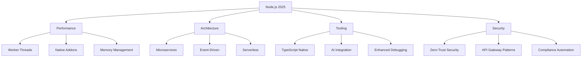
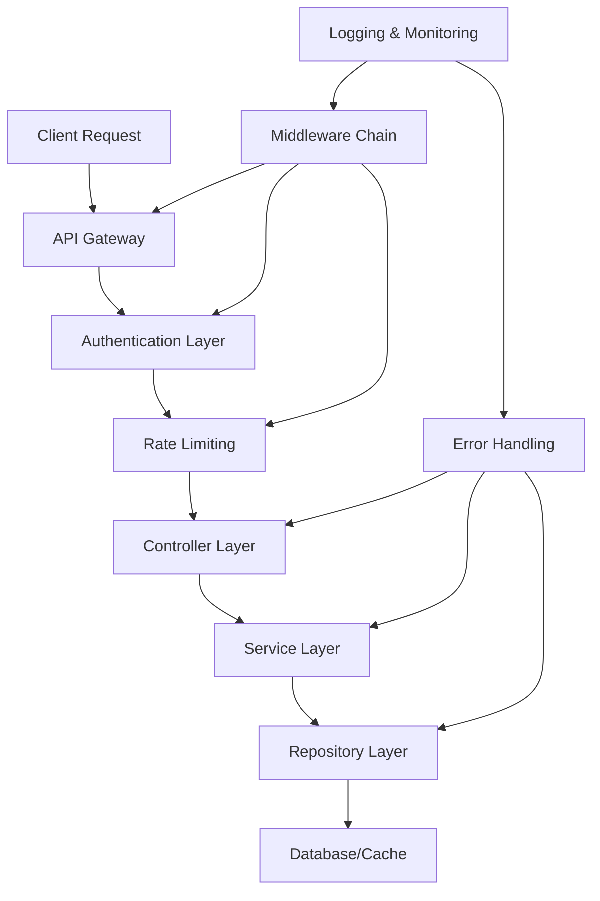
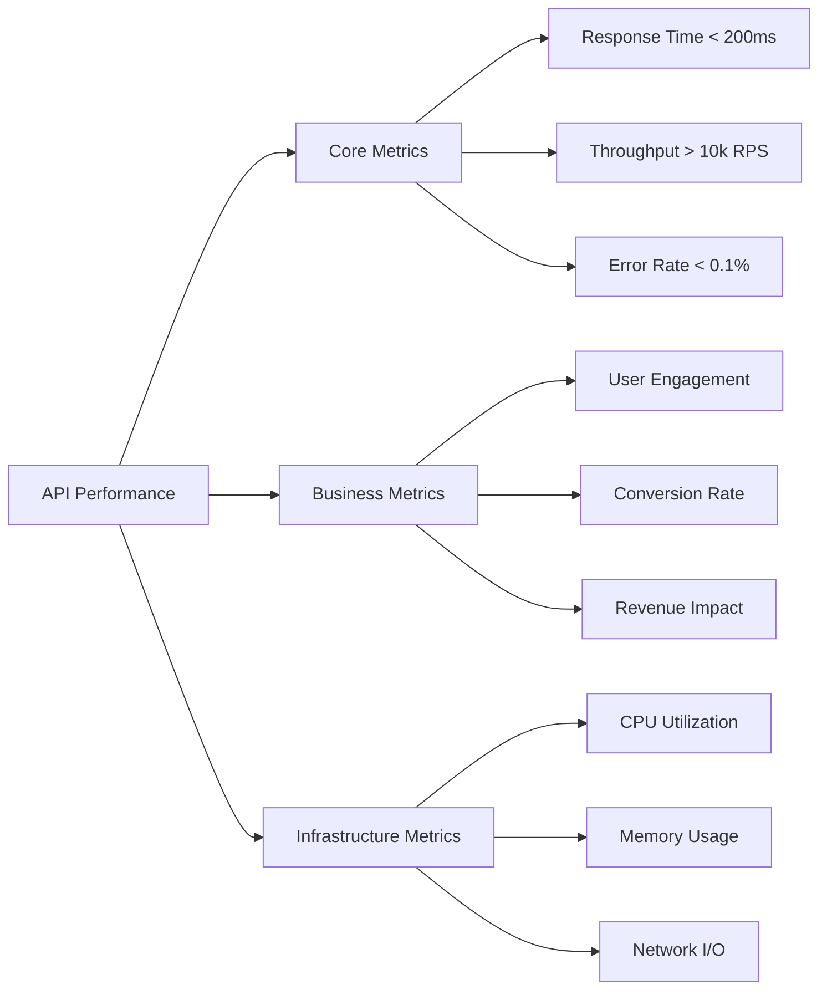

# Building Scalable APIs with Node.js: Architecture and Best Practices

Node.js has revolutionized backend development with its event-driven, non-blocking I/O model. In 2025, building scalable APIs requires understanding modern architectural patterns, performance optimization techniques, and operational best practices. This comprehensive guide covers everything you need to know to build APIs that can handle millions of requests while maintaining reliability and performance.

## Node.js Evolution: 2025 Landscape



### Key Developments for 2025:
- **Node.js 22 LTS** with enhanced performance and native TypeScript support
- **AI/ML Integration** becoming standard in backend services
- **Serverless APIs** gaining significant adoption
- **Edge Computing** integration for global latency reduction
- **Automated Security** with AI-powered threat detection

## Understanding Scalability Dimensions

Before diving into implementation, understand the different types of scalability:

- **Vertical Scaling**: Adding more resources to a single server (CPU, RAM, storage)
- **Horizontal Scaling**: Adding more servers to distribute load
- **Functional Scaling**: Breaking down monolithic applications into microservices

Node.js excels at horizontal scaling due to its lightweight, event-driven architecture.

## Modern API Architecture Patterns

### Modern Layered Architecture for 2025

Organize your code into clear layers with proper separation of concerns:



```
src/
├── controllers/     # HTTP request handlers
│   ├── user.controller.ts
│   └── auth.controller.ts
├── services/        # Business logic layer
│   ├── user.service.ts
│   └── auth.service.ts
├── repositories/    # Data access layer
│   ├── user.repository.ts
│   └── auth.repository.ts
├── models/         # Domain models and DTOs
│   ├── user.model.ts
│   └── dto/
├── middleware/     # Custom middleware
│   ├── auth.middleware.ts
│   ├── rate-limit.middleware.ts
│   └── error.middleware.ts
├── routes/         # Route definitions
│   ├── user.routes.ts
│   └── auth.routes.ts
├── config/         # Configuration management
│   ├── database.config.ts
│   └── app.config.ts
├── utils/          # Utility functions
├── types/          # TypeScript type definitions
├── events/         # Event handling (2025)
│   ├── user.events.ts
│   └── system.events.ts
└── monitoring/      # Observability (2025)
    ├── metrics.ts
    └── health.ts
```

**Example: Dependency Injection Pattern**

```typescript
// types/interfaces.ts
export interface IUserService {
  getUser(id: string): Promise<User>;
  createUser(userData: CreateUserDTO): Promise<User>;
}

export interface IUserRepository {
  findById(id: string): Promise<User | null>;
  save(user: User): Promise<User>;
}

// repositories/userRepository.ts
export class UserRepository implements IUserRepository {
  async findById(id: string): Promise<User | null> {
    const user = await db.users.findUnique({ where: { id } });
    return user;
  }

  async save(user: User): Promise<User> {
    return await db.users.create({ data: user });
  }
}

// services/userService.ts
export class UserService implements IUserService {
  constructor(private userRepo: IUserRepository) {}

  async getUser(id: string): Promise<User> {
    const user = await this.userRepo.findById(id);
    if (!user) throw new NotFoundError('User not found');
    return user;
  }

  async createUser(userData: CreateUserDTO): Promise<User> {
    // Business logic validation
    this.validateUserData(userData);

    const user = await this.userRepo.save({
      ...userData,
      createdAt: new Date(),
    });

    // Trigger welcome email asynchronously
    await this.sendWelcomeEmail(user.email);

    return user;
  }

  private validateUserData(data: CreateUserDTO): void {
    if (!data.email?.includes('@')) {
      throw new ValidationError('Invalid email format');
    }
  }

  private async sendWelcomeEmail(email: string): Promise<void> {
    // Async email sending - don't block response
    setImmediate(() => {
      emailService.sendWelcome(email);
    });
  }
}

// controllers/userController.ts
export class UserController {
  constructor(private userService: IUserService) {}

  async getUser(req: Request, res: Response): Promise<void> {
    const { id } = req.params;
    const user = await this.userService.getUser(id);
    res.json(user);
  }

  async createUser(req: Request, res: Response): Promise<void> {
    const userData = req.body as CreateUserDTO;
    const user = await this.userService.createUser(userData);
    res.status(201).json(user);
  }
}

// Dependency injection setup
const userRepository = new UserRepository();
const userService = new UserService(userRepository);
const userController = new UserController(userService);
```

### Microservices Architecture

Break down monolithic applications into focused, independently deployable services:

```typescript
// User Service (port 3001)
const express = require('express');
const app = express();

app.get('/users/:id', async (req, res) => {
  const user = await userService.getUser(req.params.id);
  res.json(user);
});

app.listen(3001, () => console.log('User service running on 3001'));

// Order Service (port 3002)
app.get('/orders/user/:userId', async (req, res) => {
  // Call User service to validate user exists
  const userResponse = await fetch(`http://user-service:3001/users/${req.params.userId}`);
  if (!userResponse.ok) return res.status(404).json({ error: 'User not found' });

  const orders = await orderService.getUserOrders(req.params.userId);
  res.json(orders);
});

app.listen(3002, () => console.log('Order service running on 3002'));
```

## Performance Optimization Techniques

### Database Optimization

**Connection Pooling:**
```typescript
import { Pool } from 'pg';

const pool = new Pool({
  connectionString: process.env.DATABASE_URL,
  max: 20, // Maximum number of clients in pool
  idleTimeoutMillis: 30000, // Close idle clients after 30 seconds
  connectionTimeoutMillis: 2000, // Return an error after 2 seconds if connection could not be established
});

// Use the pool for queries
app.get('/users', async (req, res) => {
  const client = await pool.connect();
  try {
    const result = await client.query('SELECT * FROM users');
    res.json(result.rows);
  } finally {
    client.release(); // Always release the client back to the pool
  }
});
```

**Query Optimization with Indexing:**
```sql
-- Create indexes for frequently queried columns
CREATE INDEX idx_users_email ON users(email);
CREATE INDEX idx_users_created_at ON users(created_at);
CREATE INDEX idx_orders_user_id_status ON orders(user_id, status);

-- Use EXPLAIN ANALYZE to understand query performance
EXPLAIN ANALYZE SELECT * FROM users WHERE email = 'user@example.com';
```

**Read Replicas for High-Traffic Applications:**
```typescript
const primaryDb = new Pool({ connectionString: process.env.PRIMARY_DB_URL });
const readReplicaDb = new Pool({ connectionString: process.env.REPLICA_DB_URL });

// Route reads to replica, writes to primary
app.get('/users/:id', async (req, res) => {
  const result = await readReplicaDb.query('SELECT * FROM users WHERE id = $1', [req.params.id]);
  res.json(result.rows[0]);
});

app.post('/users', async (req, res) => {
  const result = await primaryDb.query('INSERT INTO users (name, email) VALUES ($1, $2) RETURNING *',
    [req.body.name, req.body.email]);
  res.json(result.rows[0]);
});
```

### Caching Strategies

**Multi-Level Caching:**
```typescript
import Redis from 'ioredis';
import NodeCache from 'node-cache';

const redis = new Redis(process.env.REDIS_URL);
const localCache = new NodeCache({ stdTTL: 300 }); // 5 minutes TTL

// Multi-level cache implementation
async function getCachedData(key: string): Promise<any> {
  // Check local cache first (fastest)
  let data = localCache.get(key);
  if (data) return data;

  // Check Redis cache
  data = await redis.get(key);
  if (data) {
    localCache.set(key, JSON.parse(data)); // Populate local cache
    return JSON.parse(data);
  }

  // Fetch from database
  data = await fetchFromDatabase(key);

  // Cache in Redis and local cache
  await redis.set(key, JSON.stringify(data), 'EX', 3600); // 1 hour
  localCache.set(key, data);

  return data;
}
```

**HTTP Caching Headers:**
```typescript
// Cache static assets for 1 year
app.use('/assets', express.static('public', {
  maxAge: '1y',
  etag: true,
  lastModified: true
}));

// API response caching
app.get('/api/products', (req, res) => {
  res.set({
    'Cache-Control': 'public, max-age=300', // 5 minutes
    'ETag': generateETag(products),
    'Last-Modified': new Date().toUTCString()
  });
  res.json(products);
});
```

### Horizontal Scaling with Clustering

**Node.js Cluster Module:**
```typescript
import cluster from 'cluster';
import { cpus } from 'os';
import { createServer } from 'http';

const numCPUs = cpus().length;

if (cluster.isMaster) {
  console.log(`Master ${process.pid} is running`);

  // Fork workers
  for (let i = 0; i < numCPUs; i++) {
    cluster.fork();
  }

  cluster.on('exit', (worker, code, signal) => {
    console.log(`Worker ${worker.process.pid} died`);
    cluster.fork(); // Restart worker
  });
} else {
  // Worker processes
  const server = createServer((req, res) => {
    res.writeHead(200);
    res.end(`Hello from worker ${process.pid}\n`);
  });

  server.listen(8000);
  console.log(`Worker ${process.pid} started`);
}
```

**PM2 Process Manager:**
```bash
# Install PM2
npm install -g pm2

# Start application with clustering
pm2 start app.js -i max

# Zero-downtime reloads
pm2 reload app.js

# Monitor processes
pm2 monit
```

### Advanced Performance Techniques

**Streaming for Large Data:**
```typescript
app.get('/export/users', async (req, res) => {
  res.setHeader('Content-Type', 'application/json');
  res.setHeader('Transfer-Encoding', 'chunked');

  const cursor = db.collection('users').find({}).stream();

  res.write('[');

  let isFirst = true;
  cursor.on('data', (doc) => {
    if (!isFirst) res.write(',');
    res.write(JSON.stringify(doc));
    isFirst = false;
  });

  cursor.on('end', () => {
    res.write(']');
    res.end();
  });

  cursor.on('error', (err) => {
    res.status(500).end();
  });
});
```

**Circuit Breaker Pattern:**
```typescript
class CircuitBreaker {
  private failures = 0;
  private lastFailureTime = 0;
  private state: 'CLOSED' | 'OPEN' | 'HALF_OPEN' = 'CLOSED';

  async execute<T>(fn: () => Promise<T>): Promise<T> {
    if (this.state === 'OPEN') {
      if (Date.now() - this.lastFailureTime > this.timeout) {
        this.state = 'HALF_OPEN';
      } else {
        throw new Error('Circuit breaker is OPEN');
      }
    }

    try {
      const result = await fn();
      this.onSuccess();
      return result;
    } catch (error) {
      this.onFailure();
      throw error;
    }
  }

  private onSuccess() {
    this.failures = 0;
    this.state = 'CLOSED';
  }

  private onFailure() {
    this.failures++;
    this.lastFailureTime = Date.now();

    if (this.failures >= this.failureThreshold) {
      this.state = 'OPEN';
    }
  }
}
```

## Monitoring and Observability

### Application Metrics
```typescript
import { collectDefaultMetrics, register } from 'prom-client';

// Enable default metrics collection
collectDefaultMetrics();

// Custom metrics
const httpRequestDuration = new Histogram({
  name: 'http_request_duration_seconds',
  help: 'Duration of HTTP requests in seconds',
  labelNames: ['method', 'route', 'status_code'],
});

// Middleware to collect metrics
app.use((req, res, next) => {
  const start = Date.now();

  res.on('finish', () => {
    const duration = (Date.now() - start) / 1000;
    httpRequestDuration
      .labels(req.method, req.route?.path || req.path, res.statusCode.toString())
      .observe(duration);
  });

  next();
});

// Metrics endpoint
app.get('/metrics', async (req, res) => {
  res.set('Content-Type', register.contentType);
  res.end(await register.metrics());
});
```

### Health Checks
```typescript
app.get('/health', async (req, res) => {
  const health = {
    status: 'ok',
    timestamp: new Date().toISOString(),
    checks: {
      database: await checkDatabaseHealth(),
      redis: await checkRedisHealth(),
      externalServices: await checkExternalServices()
    }
  };

  const isHealthy = Object.values(health.checks).every(check => check.status === 'ok');
  res.status(isHealthy ? 200 : 503).json(health);
});

async function checkDatabaseHealth() {
  try {
    await db.raw('SELECT 1');
    return { status: 'ok' };
  } catch (error) {
    return { status: 'error', error: error.message };
  }
}
```

## Security Best Practices

### Rate Limiting
```typescript
import rateLimit from 'express-rate-limit';

const limiter = rateLimit({
  windowMs: 15 * 60 * 1000, // 15 minutes
  max: 100, // Limit each IP to 100 requests per windowMs
  message: 'Too many requests from this IP, please try again later.',
  standardHeaders: true,
  legacyHeaders: false,
});

app.use('/api/', limiter);

// Stricter limits for sensitive endpoints
const strictLimiter = rateLimit({
  windowMs: 15 * 60 * 1000,
  max: 5,
});

app.use('/api/auth/login', strictLimiter);
```

### Input Validation and Sanitization
```typescript
import Joi from 'joi';
import sanitizeHtml from 'sanitize-html';

// Request validation middleware
const validateUser = (req: Request, res: Response, next: NextFunction) => {
  const schema = Joi.object({
    name: Joi.string().min(2).max(100).required(),
    email: Joi.string().email().required(),
    age: Joi.number().integer().min(13).max(120)
  });

  const { error } = schema.validate(req.body);
  if (error) {
    return res.status(400).json({ error: error.details[0].message });
  }

  // Sanitize HTML inputs
  if (req.body.bio) {
    req.body.bio = sanitizeHtml(req.body.bio, {
      allowedTags: ['b', 'i', 'em', 'strong', 'a'],
      allowedAttributes: {
        'a': ['href']
      }
    });
  }

  next();
};

app.post('/users', validateUser, createUser);
```

## Deployment and Infrastructure

### Docker Containerization
```dockerfile
FROM node:18-alpine

WORKDIR /app

# Copy package files
COPY package*.json ./
RUN npm ci --only=production

# Copy source code
COPY . .

# Build the application
RUN npm run build

EXPOSE 3000

# Use PM2 for production
CMD ["npm", "run", "start:prod"]
```

### Kubernetes Deployment
```yaml
apiVersion: apps/v1
kind: Deployment
metadata:
  name: api-server
spec:
  replicas: 3
  selector:
    matchLabels:
      app: api-server
  template:
    metadata:
      labels:
        app: api-server
    spec:
      containers:
      - name: api-server
        image: my-api:latest
        ports:
        - containerPort: 3000
        env:
        - name: NODE_ENV
          value: "production"
        resources:
          requests:
            memory: "256Mi"
            cpu: "250m"
          limits:
            memory: "512Mi"
            cpu: "500m"
        livenessProbe:
          httpGet:
            path: /health
            port: 3000
          initialDelaySeconds: 30
          periodSeconds: 10
        readinessProbe:
          httpGet:
            path: /health
            port: 3000
          initialDelaySeconds: 5
          periodSeconds: 5
```

## 2025-Specific Considerations

### AI-Powered APIs
```typescript
// AI-enhanced service layer
class AIEnhancedService {
  private aiClient: OpenAIClient;
  private cache: Redis;

  async processWithAI(data: InputData): Promise<Result> {
    // Check cache first
    const cached = await this.cache.get(`ai:${data.hash}`);
    if (cached) return cached;

    // Process with AI
    const result = await this.aiClient.chat.completions.create({
      model: 'gpt-4-turbo',
      messages: [{ role: 'system', content: this.buildPrompt(data) }],
      temperature: 0.1
    });

    // Cache the result
    await this.cache.set(`ai:${data.hash}`, result, { ex: 3600 });
    
    return result;
  }
}
```

### Edge Computing Integration
```typescript
// Edge deployment strategy
const edgeConfig = {
  regions: ['us-east-1', 'eu-west-1', 'ap-southeast-1'],
  strategy: 'latency-based',
  failover: true,
  cacheTTL: 300
};

// Deploy to multiple edge locations
const edgeApp = new EdgeApp(app, edgeConfig);
```

### Modern Security Patterns
```typescript
// Zero-trust security implementation
class ZeroTrustMiddleware {
  async validateRequest(req: Request, res: Response, next: NextFunction) {
    // Verify token with multiple factors
    const tokenValid = await this.verifyToken(req.headers.authorization);
    const deviceTrusted = await this.verifyDevice(req.headers['user-agent']);
    const locationValid = await this.verifyLocation(req.ip);
    
    if (tokenValid && deviceTrusted && locationValid) {
      next();
    } else {
      res.status(403).json({ error: 'Access denied' });
    }
  }
}
```

## Performance Metrics for 2025



## Conclusion

Building scalable APIs with Node.js requires a holistic approach that encompasses architecture, performance optimization, monitoring, and operational excellence. The key principles to remember for 2025:

1. **Start with a solid architecture** using layered design and dependency injection
2. **Optimize at every level** - database, caching, application code, and infrastructure
3. **Monitor everything** - implement comprehensive observability with AI-powered insights
4. **Plan for failure** - use circuit breakers, retries, and graceful degradation
5. **Scale globally** - use edge computing, multi-region deployment, and intelligent routing
6. **Automate everything** - deployment, scaling, monitoring, and security
7. **Embrace AI** - integrate AI capabilities for intelligent processing and automation
8. **Prioritize security** - implement zero-trust architectures and automated threat detection

Remember that scalability in 2025 is not just about handling more traffic—it's about maintaining performance, reliability, security, and developer productivity while delivering intelligent, personalized experiences. Start small, measure everything, leverage AI, and scale intelligently based on real data and user behavior patterns.