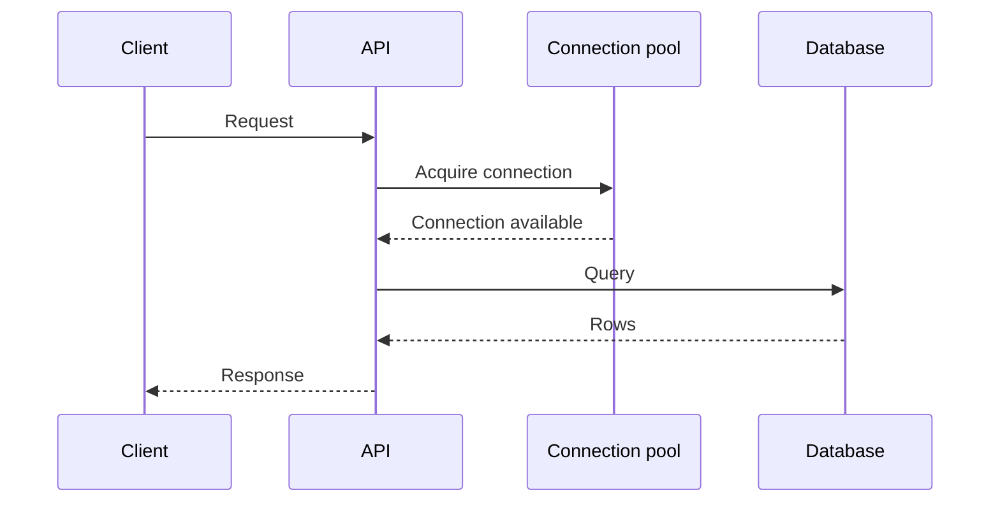

An API request can be slow while its Node.js process is mostly idle. It might be waiting for a database connection, a query, or another service. Adding another API process only helps if the overloaded resource can use the extra concurrency.

Start with one request and account for its time.

## Separate waiting from work

This small helper measures an asynchronous operation with Node's monotonic performance clock. It belongs around a specific operation, such as a query, rather than around every function call.

```javascript
import { performance } from 'node:perf_hooks';

export async function timed(operation, run) {
  const start = performance.now();
  try {
    return await run();
  } finally {
    console.log(JSON.stringify({
      operation,
      durationMs: performance.now() - start,
    }));
  }
}
```

The `finally` block records failed operations too. In a service, attach a request ID and send measurements to the existing telemetry system. Keep operation names bounded, such as `load_order`; a metric label containing every order ID creates an ever-growing set of time series.

Look at the distribution as well as the average. A small fraction of very slow requests can make an application unpleasant while leaving its mean latency looking acceptable.


```mermaid
sequenceDiagram
    participant Client
    participant API
    participant Pool as Connection pool
    participant DB as Database
    Client->>API: Request
    API->>Pool: Acquire connection
    Pool-->>API: Connection available
    API->>DB: Query
    DB-->>API: Rows
    API-->>Client: Response
```

Pool wait time and query execution time are separate measurements. Conflating them can send an investigation in the wrong direction.

## Count connections across all processes

A PostgreSQL pool limit applies to one pool. If ten API processes each allow twenty connections, the deployment can try to open two hundred connections before accounting for workers, migrations, or administrative clients.

A pool prevents connection setup on every request, but it also forms a queue when all connections are busy. Raising the limit may reduce that queue or overload the database. Inspect query plans and the workload before changing it. The [node-postgres pool sizing notes](https://node-postgres.com/guides/pool-sizing) discuss this across multiple service instances.

An index is a response to an actual query pattern. It costs storage and write work, so adding one for every column is a poor substitute for checking the query plan. Read replicas can move read traffic, but replication lag matters when a client expects to read back a write immediately.

## Decide what a cache is allowed to return

A product description may tolerate a short delay after an edit. Account permissions usually have different requirements. Before adding a cache, define its key, who may read the value, and how long it may be stale.

A process-local cache creates one copy per process. Redis can provide shared storage, but the application still owns expiration and invalidation rules. Deploying more replicas doesn't resolve a stale-value bug.

Cache misses also arrive in groups. If a popular value expires, many requests may recompute it at once. Coalescing requests for the same key can reduce that load, provided a failed computation releases the waiting callers.

## Keep synchronous work out of the request path

Asynchronous I/O lets Node handle other work while a request waits. A long synchronous calculation still occupies the event loop. Large JSON operations, compression, and CPU-heavy transformations deserve measurement even if their surrounding function is declared `async`.

Node's [event-loop guide](https://nodejs.org/en/learn/asynchronous-work/dont-block-the-event-loop) explains the distinction. Worker threads are an option for CPU work; they bring message-passing and lifecycle costs. For large exports, streaming can avoid holding the whole response in memory, but the producer must respect backpressure when the client reads slowly.

## Bound failures

An upstream call needs a deadline. A retry needs a limit and a reason to be safe. Retrying an order submission after a timeout can duplicate the order if the first attempt succeeded but its response was lost.

Liveness and readiness checks answer different questions. A live process may temporarily be unable to serve requests. If every dependency failure restarts every API instance, the health check can make an outage harder to recover from.

During shutdown, stop accepting new work, allow in-flight requests a bounded drain period, and close pools. Include that path in deployment testing; a successful startup says nothing about what happens to requests during replacement.

## Make one change and repeat the workload

Record the request mix, concurrency, response sizes, and database state with a load test. Compare throughput, latency percentiles, error rate, and resource use before and after a change.

An extra replica is useful evidence if it improves the measured bottleneck. If database wait time simply grows, the next investigation belongs there. A microservice split or a Kubernetes deployment doesn't by itself explain why the request was slow.
